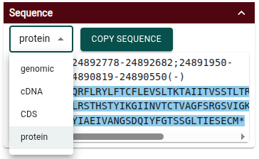

# Beta Version 0.3.6

We would like to thank all those who have given feedback on Apollo 3 since our
initial beta release of version `v0.3.0` in December. We have continued to work
on improving the experience for Apollo 3 users over the course of several
versions, and we'd like to highlight some of the new features we've completed
between then and our newest current release, version `v0.3.6`.

<!-- truncate -->

## New features

### Add feature from JBrowse 2 gene track

Right-click on a feature such as a gene in a JBrowse 2 evidence track and select
"Create Apollo annotation" to create a new Apollo annotation from that feature.
Attributes on the feature are also copied into the new Apollo annotation.


### Filter visible features in the display

From the track menu, select "Filter features by type" to filter what features
are available in the Apollo track. This could be used, for example, when you
want to focus on a subset of all your annotations, such as pseudogenes.


### Export GFF3 using Apollo CLI

Previously GFF3 export was only available from the Apollo menu in the UI. Now it
can also be done with the Apollo CLI.

```sh
apollo export gff3 myAssembly > out.gff3
```

### Protein sequence now included in transcript details

The "Sequence" section of a transcript's details widget now includes the option
to view the protein sequence.



:::tip

For any of the sequence viewing options, the sequence is in FASTA format. When
you use the "Copy sequence" button, the FASTA sequence can be pasted in plain
text format (e.g. in a text editor) or with the color highlights (e.g. in Google
Docs).

:::

### Improved transcript details widget

The transcript details widget now includes a more compact summary of the
transcript. It also includes the transcript's protein translation with start and
stop codons highlighted as well as the ability to "trim" the CDS to match the
nearest start and stop codons if needed with a single click.


### More options available in "Add new assembly" in the UI

The "Add new assembly" dialog in the UI has been improved to add functionality
that was previously only available in the Apollo CLI.


### Shortcuts in "Add a feature"

When adding a new feature from scratch, there is now a shortcut to add a gene or
transcript with all the necessary subfeatures in a single action.


:::tip

Access the "Add a feature" dialog by selecting an area in the view ruler track
and choosing "Add new feature" from the menu.


:::

### Six frame display

A new display type, the Apollo Six-frame Display, is available for Apollo
tracks. It can be accessed from the track menu under "Display types."

This type of view is inspired by the
[Artemis](https://sanger-pathogens.github.io/Artemis/Artemis/) genome annotation
tool and will continue to be updated with more functionality.


## Improved functionality

### Sequence ontology used to compare equivalent terms

Improvements have been made in using the the configured feature ontology (by
default the Sequence Ontology) to detect valid terms for various annotation
structures. Any valid ontology terms can be used. For example, you could use the
term "exon_of_single_exon_gene" instead of "exon" and Apollo will automatically
recognize that as a valid term for the child of a transcript without any
additional configuration.

### Non-coding genes now render with a gene glyph

Genes without a coding sequence, such as pseudogenes or ncRNA genes, now have
improved rendering to match that of coding genes.

## Upcoming

### Customization

We are working on expanding the options to customize Apollo to fit your own
needs. Stay tuned for more information on this soon.
