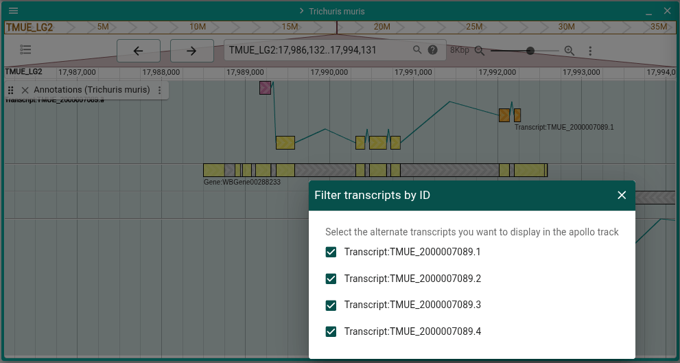
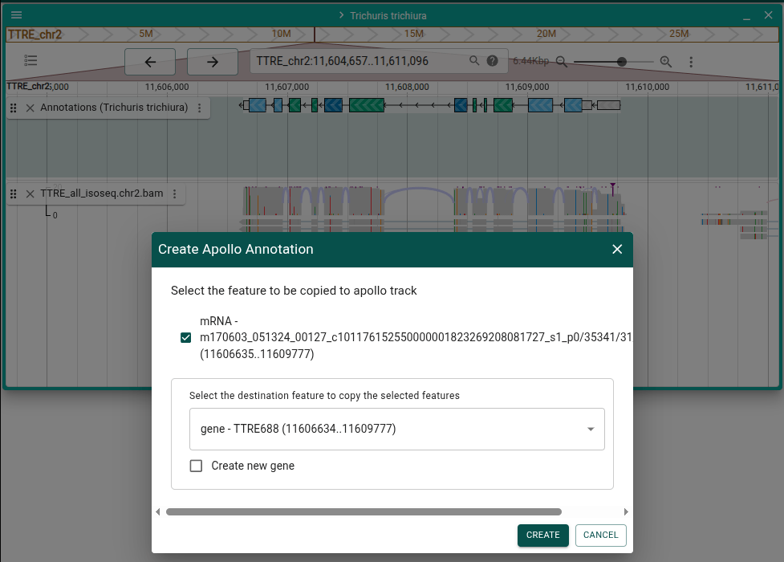
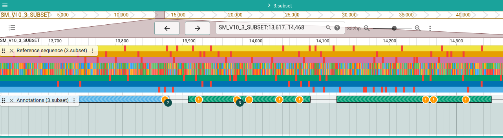

# Beta Version 0.3.8

We are excited to release version `v0.3.8` of Apollo 3, which includes many new
features inspired by feedback from users. Below are some of the changes since
`v0.3.6` that we'd like to highlight.

Also, when updating Apollo 3 to this version, please make sure to also update
JBrowse 2 to at least `v3.6.5` as there are some important stability
improvements that require JBrowse 2 to be updated to take effect.

<!-- truncate -->

## New features

### Apollo Reference Sequence Track

Prior to this release, Apollo would draw the sequence directly on the
"Annotations" track if you were zoomed in close enough. However, this could
cause the annotations to jump around at depending on the zoom level, and there
was no way to hide it for users who didn't want to see it.

In this release, instead of being drawn directly in the "Annotations" track, the
sequence is available as the default display in the built-in "Reference
sequence" track, allowing it to have its own dedicated space. The interactions
with the "Annotations" track, such as highlighting the currently hovered CDS,
still work the same, and if needed the default JBrowse display can be toggled on
from the track menu.

### Merge and split exons

There is a new command that will merge two exons into a single one, as well as
an accompanying command to split an exon into two separate exons.

### Merge transcripts

Transcripts can now be merged, and Apollo 3 will create a new transcript with
its subfeatures automatically calculated from the overlap of the source
transcripts.

### Redo

In addition to the existing "Undo" functionality, "Redo" is also now available
from the top-level Apollo menu.

### Go to neighboring exons

A new method of navigation is available in the form of new menu items "Go to
upstream/downstream exon". This is especially useful when navigating at a high
zoom level in genes with large introns.

### Locked mode

A new option is available from the top-level Apollo menu that allows you to lock
and unlock editing. When locked, no edits are able to be made, allowing you to
be able to freely explore the data without risk of accidental editing.

## Improved functionality

### Labels in six-frame view

The six-frame view now provides labels for its features. These can also be
disabled in the track menu for a more compact view.

### Filter transcripts in six-frame view

In the six-frame view, if there are alternate transcripts and you want to focus
on just one of them, you can now select which transcripts to filter out of the
current view.

### Copy feature from alignments track into an existing gene

Read features in a JBrowse alignments track (such as from a BAM or CRAM file)
can now be copied as transcript features into an existing gene, in addition to
the being able to create a new gene.

### Right-click menu lists all features for a location

The right-click (a.k.a. context) menu for gene glyphs has been updated to show
actions for any feature that overlap the current location.

### Check results clustering

Check result warning symbols are now clustered together when they overlap, which
helps prevent clutter in the display. The warning symbols can also be turned off
completely from the track menu.

### Selection, select when adding a feature

When you add a new feature, whether top-level or a child feature (i.e. a
transcript), the feature is now selected in the UI allowing you to more easily
identify it.

## For more information

For more details on any of the changes mentioned as well as many more changes
that have been made, you can reference the related GitHub issues.

- Improve click and drag actions by @garrettjstevens in
  https://github.com/GMOD/Apollo3/pull/595
- Improve transcript widget edit location action by @shashankbrgowda in
  https://github.com/GMOD/Apollo3/pull/598
- Feature expand/contract rows for feature labels in LinearApolloSixFrameDisplay
  by @haessar in https://github.com/GMOD/Apollo3/pull/579
- Show details widget when we click on feature in gene glyph by @shashankbrgowda
  in https://github.com/GMOD/Apollo3/pull/576
- Show feature details widget on click when in LASFD by @haessar in
  https://github.com/GMOD/Apollo3/pull/602
- Add ability to merge and split exons by @dariober in
  https://github.com/GMOD/Apollo3/pull/574
- Show all genes in the region as destination when adding feature from evidence
  track by @shashankbrgowda in https://github.com/GMOD/Apollo3/pull/588
- Alternate transcripts filtering for LinearApolloSixFrameDisplay by @haessar in
  https://github.com/GMOD/Apollo3/pull/591
- Update Cypress tests to work on latest JBrowse by @garrettjstevens in
  https://github.com/GMOD/Apollo3/pull/614
- Fix and improve adding feature from BAM track to Apollo track by
  @shashankbrgowda in https://github.com/GMOD/Apollo3/pull/607
- Make context menu list all possible features for that location by @dariober in
  https://github.com/GMOD/Apollo3/pull/618
- Add open transcript details option on right click of child feature by
  @shashankbrgowda in https://github.com/GMOD/Apollo3/pull/608
- Print gff_id when reporting errors by @dariober in
  https://github.com/GMOD/Apollo3/pull/610
- New gene or transcript must have strand set by @dariober in
  https://github.com/GMOD/Apollo3/pull/619
- Fix loading non-Apollo plugins from stored config by @garrettjstevens in
  https://github.com/GMOD/Apollo3/pull/613
- Split docker build action by platform arch by @amorison in
  https://github.com/GMOD/Apollo3/pull/616
- Add "Merge transcripts" action by @dariober in
  https://github.com/GMOD/Apollo3/pull/604
- Add option in UI to download GFF without FASTA by @dariober in
  https://github.com/GMOD/Apollo3/pull/625
- Add ability to configure assembly aliases in the UI by @shashankbrgowda in
  https://github.com/GMOD/Apollo3/pull/620
- Fix undo only undoing the last change by @dariober in
  https://github.com/GMOD/Apollo3/pull/622
- Improve click and drag actions in LASFD by @haessar in
  https://github.com/GMOD/Apollo3/pull/624
- Fix:Update CDS locations for translation trim without validation by
  @shashankbrgowda in https://github.com/GMOD/Apollo3/pull/609
- Fix copy to clipboard not working in some contexts by @garrettjstevens in
  https://github.com/GMOD/Apollo3/pull/627
- Resize gene/transcript after deleting exon by @dariober in
  https://github.com/GMOD/Apollo3/pull/632
- Fix reverse strand protein translation in sequence panel by @garrettjstevens
  in https://github.com/GMOD/Apollo3/pull/628
- Update test image snapshots by @garrettjstevens in
  https://github.com/GMOD/Apollo3/pull/648
- Context menu list for LASFD by @haessar in
  https://github.com/GMOD/Apollo3/pull/644
- Make the "hovered feature" available to all displays on the session by
  @garrettjstevens in https://github.com/GMOD/Apollo3/pull/641
- Add custom display to reference sequence track, don't render sequence on
  Apollo track by @garrettjstevens in https://github.com/GMOD/Apollo3/pull/642
- Fix LASFD tooltip rendering bug by @haessar in
  https://github.com/GMOD/Apollo3/pull/651
- Fix file path retrieval in desktop by @garrettjstevens in
  https://github.com/GMOD/Apollo3/pull/652
- Bring LASFD into line with recent changes to reference sequence track by
  @haessar in https://github.com/GMOD/Apollo3/pull/655
- Add `justfile` and instructions for developers by @amorison in
  https://github.com/GMOD/Apollo3/pull/638
- Add more custom component extension points to the transcript widget by
  @garrettjstevens in https://github.com/GMOD/Apollo3/pull/649
- Redo functionality - issue #629 by @dariober in
  https://github.com/GMOD/Apollo3/pull/645
- Add menu item to hide/show check results by @haessar in
  https://github.com/GMOD/Apollo3/pull/653
- Keep all attributes of merged features by @dariober in
  https://github.com/GMOD/Apollo3/pull/640
- Add sequence length to and reformat the sequence panel FASTA header by
  @dariober in https://github.com/GMOD/Apollo3/pull/663
- Fix wrapping of cDNA sequence by @dariober in
  https://github.com/GMOD/Apollo3/pull/667
- Cluster check results to improve performance by @haessar in
  https://github.com/GMOD/Apollo3/pull/664
- Add ability to change zoom display threshold by @haessar in
  https://github.com/GMOD/Apollo3/pull/668
- Fix assembly not persisting in desktop when opened vi UI by @garrettjstevens
  in https://github.com/GMOD/Apollo3/pull/670
- Add canonical splice site check, improve check/check result testing #636 by
  @dariober in https://github.com/GMOD/Apollo3/pull/657
- Improve navigatation: go to up/downstream exon, go to from table editor by
  @dariober in https://github.com/GMOD/Apollo3/pull/671
- Fix models not getting cleaned up, including multiple websocket fix by
  @garrettjstevens in https://github.com/GMOD/Apollo3/pull/656
- Update display of selected feature, select a feature when adding it by
  @garrettjstevens in https://github.com/GMOD/Apollo3/pull/674
- Introduce locked annotation mode (#659) by @dariober in
  https://github.com/GMOD/Apollo3/pull/675
- Reorganize and add icons to top-level Apollo menu by @garrettjstevens in
  https://github.com/GMOD/Apollo3/pull/676
- Add arrows on transcript line to show strand by @garrettjstevens in
  https://github.com/GMOD/Apollo3/pull/677
- apollo-cli: new `desktop` cmd generates/opens jbrowse files by @amorison in
  https://github.com/GMOD/Apollo3/pull/666

### New Contributors

- @amorison made their first contribution in
  https://github.com/GMOD/Apollo3/pull/616

**Full Changelog**: https://github.com/GMOD/Apollo3/compare/v0.3.6...v0.3.8
