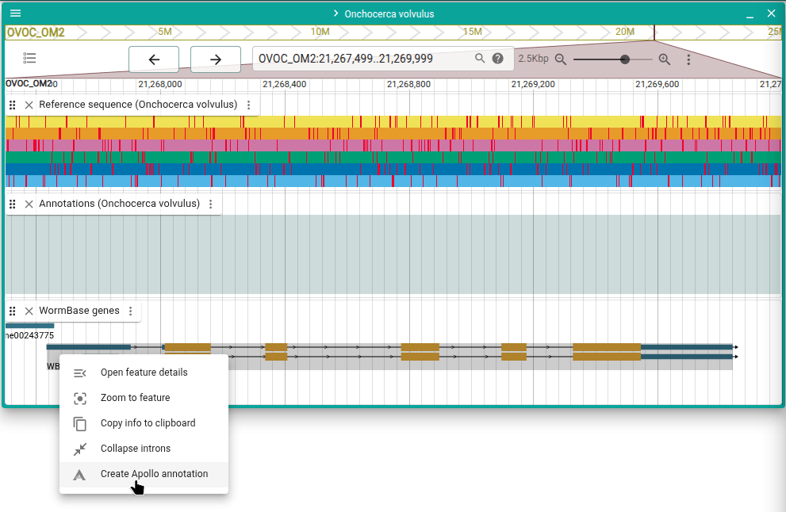
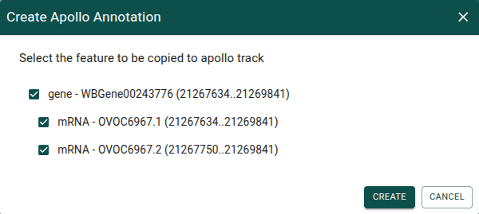
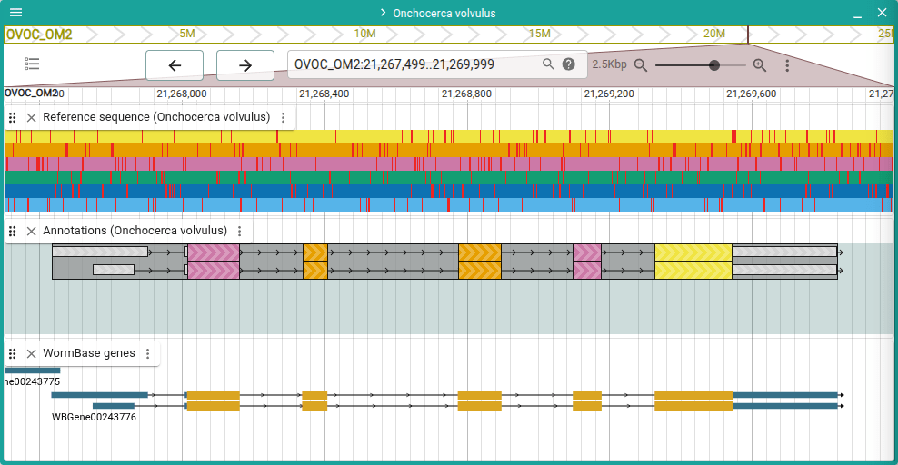

# Add a gene

Add a gene from a JBrowse evidence track.

:::tip

Every page in this guide has a "Try it out" button. This will take you to a page
where you can try out the steps for yourself. Any annotations you create or edit
are local and not shared, so no need to worry about affecting the annotations
anyone else using this guide sees.

:::

<a href="/demo/?assembly=Onchocerca%20volvulus&loc=OVOC_OM2:21267500-21270000&tracks=onchocerca_volvulus.PRJEB513.WBPS19.genomic-ReferenceSequenceTrack,apollo_track_Onchocerca%20volvulus,onchocerca_volvulus.PRJEB513.WBPS19.annotations.genes.sorted.gff3&tracklist=true"
className="button button--primary button--lg" target="\_blank">Try
it out</a>

---

Right-click on a gene in a JBrowse genes track and select "Create Apollo
annotation" from the menu.

In the dialog that appears, select "Create".

That's all! You now have an editable gene annotation in your Apollo track. Read
on in the user guide for more information on what you can do with the gene
annotation.

