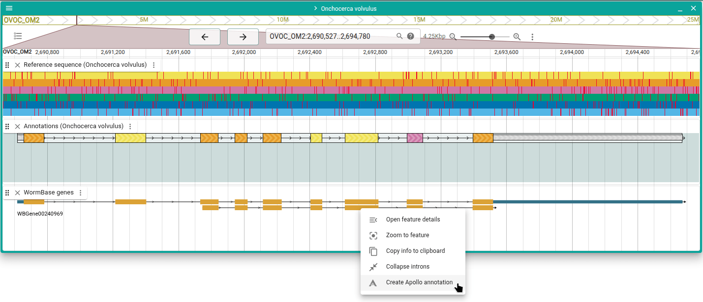
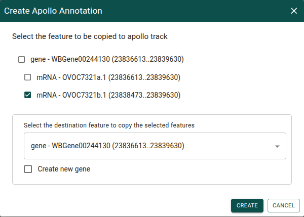
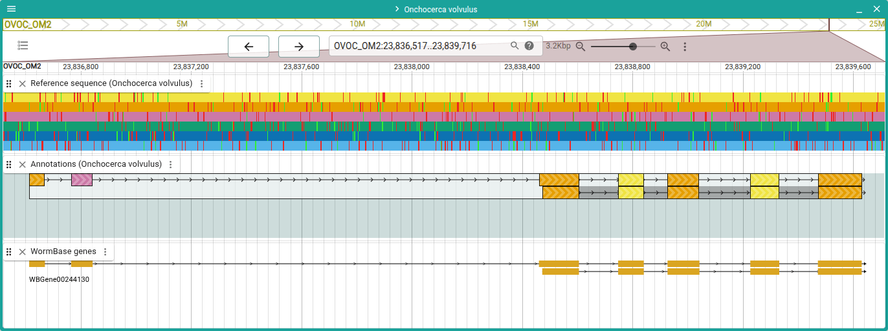

# Add a transcript

Add a transcript from a JBrowse evidence gene track.

:::tip

Every page in this guide has a "Try it out" button. This will take you to a page
where you can try out the steps for yourself. Any annotations you create or edit
are local and not shared, so no need to worry about affecting the annotations
anyone else using this guide sees.

:::

<a href="/demo/?assembly=Onchocerca%20volvulus&loc=OVOC_OM2:2689000-2695000&tracks=onchocerca_volvulus.PRJEB513.WBPS19.genomic-ReferenceSequenceTrack,apollo_track_Onchocerca%20volvulus,onchocerca_volvulus.PRJEB513.WBPS19.annotations.genes.sorted.gff3&tracklist=true&apolloFeatures=H4sIAAAAAAAAA7XWXW-bMBQG4L8ynWs6-SsGc7dm0q62TOu0XkQRcoyTWgs2NZB1ivjvE6RbPrrEomNXCF4fzoNlYe9gZtWDU9or-WbrNttm01SQzneQmRxS4JJxyZIliRleqpgiTjHmhEMEXq_u9COkMPs2m2azjwQiqH-WGlJYa6shgsJYSAkXiGMeQSGf-jvGYxpBVXtpc0hxBOrBbHKvLaS7C_2w6rJrIqyui4ovn96NKkJBEbou0k_OXhShOMEnIlnX3iybWldd3_VqlVWu8UpDOod754tbWWlYtG10SYODXjzIiwlmBy9miI7rJUEvGeaNKTnyJoyN66VBLx3mFYwevASRkdcDC3rZIC_Bx-uBECLG9U6C3skwL0PHXhbzcb086A38Q8-9_GR-Ezzy_MZBbzzMKwQ-eClKRvYmQW8yyEupoFd2hH_2iqBXXPdO39-dbBeTo-2CTnDyCm7UJ51p3r0-7ZoyzJH8HVlZ9CUnQel1blRtnM2qWtb9cQGmzq6ML3TejfjhfFHqcl_5GYmEke7xxqn94NnW3ZTF9xvczVj7Gu1XL22lvCnrA_otvsjeR_-f9UFbnd7fdheECEOCi3PTy_Rv_SOo9GOjrdIvPqYLl8btV8UcSu9qbWymXG7suq90Wa198afwdETWn80WEajGm2fRBbLcGHkGi44YbbtofwG7y3-IPwoAAA"
className="button button--primary button--lg" target="_blank">Try
it out</a>

---

Here we see an Apollo annotation that has a single transcript, with a JBrowse
evidence track that shows a second transcript. To add the second transcript to
the Apollo annotation, start by right-clicking on the gene in the JBrowse track
and selecting "Create Apollo annotation."

In the dialog that appears, uncheck the gene and the first mRNA, since we only
want to copy the second transcript. Make sure the gene in the destination
feature drop-down box is the one to which we want to copy the transcript. Also
make sure to not check the "Create new gene" box, since we're targeting an
existing gene. Then click "Create."

The transcript has now been added and is ready for any additional editing with
Apollo.

