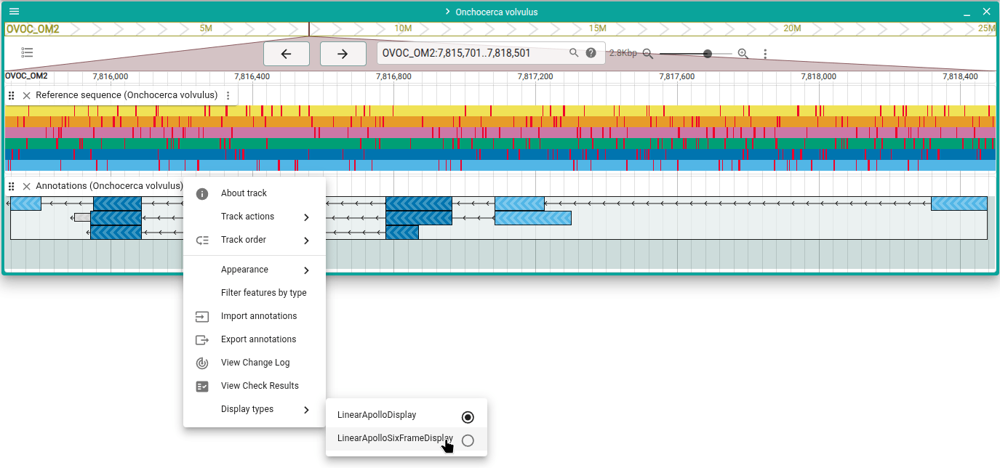
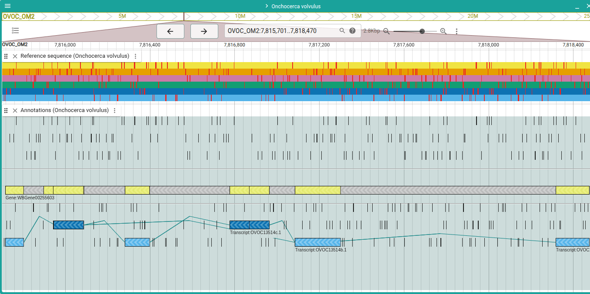

# Open six-frame display

Open the Apollo track's six-frame display mode.

:::tip

Every page in this guide has a "Try it out" button. This will take you to a page
where you can try out the steps for yourself. ANAny annotations you create or
edit are local and not shared, so no need to worry about affecting the
annotations anyone else using this guide sees.

:::

<a href="/demo//?assembly=Onchocerca%20volvulus&loc=OVOC_OM2:7815701-7818501&tracks=onchocerca_volvulus.PRJEB513.WBPS19.genomic-ReferenceSequenceTrack,apollo_track_Onchocerca%20volvulus&apolloFeatures=H4sIAAAAAAAAA82YyW7bMBBAf6WYs1qQWihKtyYFemodNEVzMAKBpKiEgEU5lJwmCPzvBe2k8VKKlaWDT4YxQ82DZ_RI-gVmWtw3QhrBPjw2i8fVYtVCPn-BQpWQA2GR5GFJ40jEPKtiVJYo5BhDAEZW1_IBcpj9ml0Ws28hBNA9LyXkcCe1hABqpSFPKU5STAKo2dPmG41TEkDbGaZLyD_iAMS9WpRGashfHAVRbGN9SCjuR6p_fP88JRKrSg-SzehFkk-NdiIlFMX7SKzrjOKrTra28F1VFW2zMkJCPoebxtQXrJVwu14HLhzpBZbDgLMEvQMTROnEwJUXuBoETEKKd4CjLJsUmCPknVI0DDhNd0aCZCSZGBh7gT1v-gFwimj0DpyG4bQzzFHoBQ4HAdOo3wOjgSMvcNQPfPnleoC3_o832EQs1Nw-P7dVcZTgmL3FNKs3a_YjSyNLJTrV6KLtWLfZKeCKmU6xxeK5EI2ulKllaXN_N6ZeyuX2IVc4JojaH2p9CuNPw3QrjFp2O6ifsBt2G3MgOHvFvb3iwzYZmu00K40QGrzvJV6kZJiz95AmdzZHxAtMzsvZqRc4PS9nUy8wHePsoykdDZx5gbNBCsziCXidCuROq3CnAi_7xJfQeFLx8R7x8X-L7xXB1SHsPbdgz7nlUHx7LSI0HS4-4R0aMfCwuoc0vfh81wGbcVbi810HbMYI8R01fTSw7zpgM072yKm8To8I50sqTvMIwcmkHhE9HhGOA9QIhK9Sy_zmwn4gFCYJQdFh-eNoKx9WUgt5TGijXDXbzs5haZpOKl2IplT6brO0KTpp6r8r9zOKzV8UtwGIlVGvxR10bKFYe1B7vb5d_wGcPevXOxEAAA"
className="button button--primary button--lg" target="\_blank">Try
it out</a>

---

From the Apollo track menu, under the "Display types" category choose
"LinearApolloSixFrameDisplay."

The six-frame view allows a different way of inpsecing the coding sequences of
annotations. To switch back to the original display, choose
"LinearApolloDisplay" in the "Display types" menu category.

