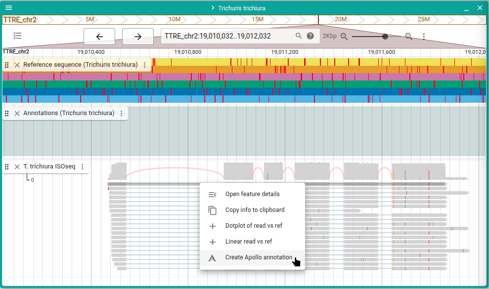
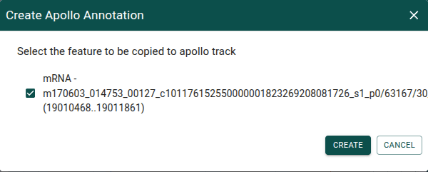
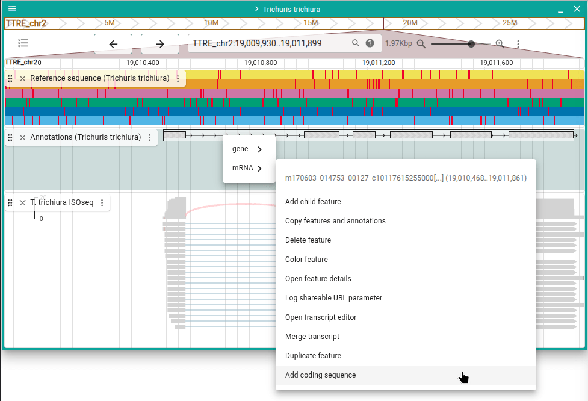
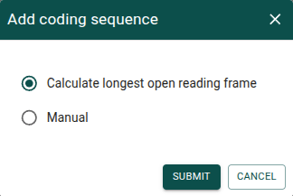
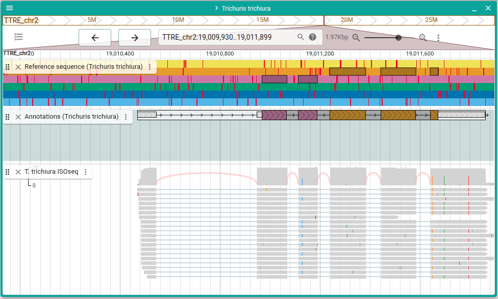

# Add gene from RNA-seq

Add a gene from an JBrowse alignments track RNA-seq read.

:::tip

Every page in this guide has a "Try it out" button. This will take you to a page
where you can try out the steps for yourself. Any annotations you create or edit
are local and not shared, so no need to worry about affecting the annotations
anyone else using this guide sees.

:::

<a href="/demo/?assembly=Trichuris%20trichiura&loc=TTRE_chr2:19010000..19,012,000&tracks=Trichuris trichiura-ReferenceSequenceTrack,apollo_track_Trichuris%20trichiura,TTRE_all_isoseq.chr2&tracklist=true"
className="button button--primary button--lg" target="_blank">Try
it out</a>

---

In this JBrowse evidence track, we have RNA-seq reads that show evidence for a
gene in this location. To add a gene annotation from this evidence, right-click
on one of the reads in the evidence track and click "Create Apollo annotation."

In the dialog that appears, select "Create".

Now we have a gene with one transcript in our annotations. We probably also want
to add a coding sequence to this transcript. To do so, right-click on the
transcript and choose "Add coding sequence" from the mRNA sub-menu.

In the dialog that appears, select "Submit".

You can now see that a coding sequence has been created for this transcript
using the longest open reading frame.

