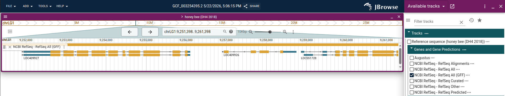
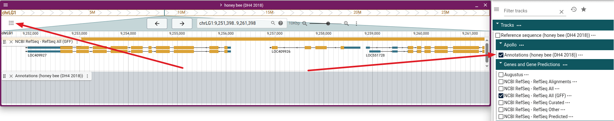
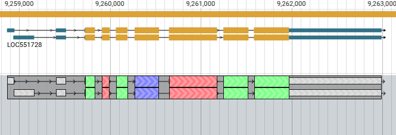

# Apollo on JBrowse Web

One of the easiest ways to get started using Apollo is from an existing
installation of JBrowse 2 on the web. Maybe you've already set up JBrowse 2 for
your data, maybe the genome you're working on has publically available JBrowse
instance hosted by e.g. a model organism database, or maybe the genome is
available on [genomes.jbrowse.org](https://genomes.jbrowse.org/).

:::tip

If you have your genome's data but there isn't a JBrowse instance available for
it, try our
[guide for using Apollo on JBrowse Desktop](./02-jbrowse-desktop.md).

:::

## Tutorial

In this tutorial, we'll walk through setting up Apollo on a publically available
genome on [genomes.jbrowse.org](https://genomes.jbrowse.org/). The same steps
will apply, though, for using any JBrowse instance.

We'll start by opening a JBrowse instance set up for the honey bee (_Apis
mellifera_) genome. Start by going to this page:

https://genomes.jbrowse.org/accession/GCF_003254395.2/

Then, click on the "JBrowse" link under "Genome browsers." On the JBrowse app
that opens, click on the track on the right side called "NCBI RefSeq - RefSeq
All (GFF)." This will open a track with gene models.

Let's say you wanted to try editing one of those gene models. That is where we
can use Apollo. To add Apollo to JBrowse, first open the "Tools" menu in the top
menu bar and select "Plugin store."

Then either scroll down or search for Apollo in the plugin store and click the
"Install button."

The app will then reload. Re-open the track selector by clicking the track
selector button in the view header. You'll now see that there is a new track
category called "Apollo" with a track called "Annotations (honey bee (DH4
2018))". Select that track to open it.

To start editing a gene model, right click on a gene in the RefSeq track and
select "Create Apollo annotation."

In the dialog that pops up, click "Create." The gene model will then appear in
the Apollo Annotations track.

Congratulations! You've now started using Apollo. For guidance on what types of
edits you can make to the gene model annotation, see our
[user guide](../user-guide/).
