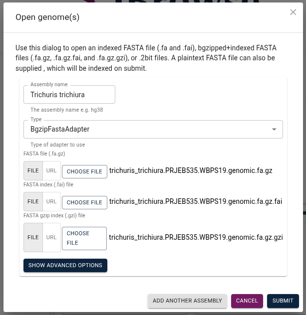
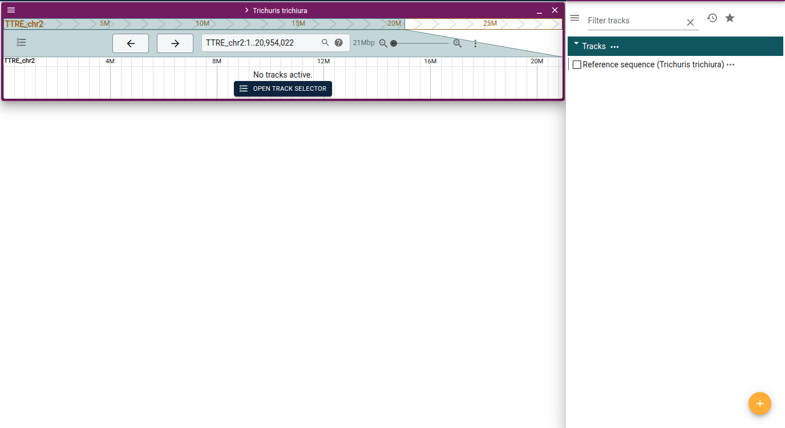
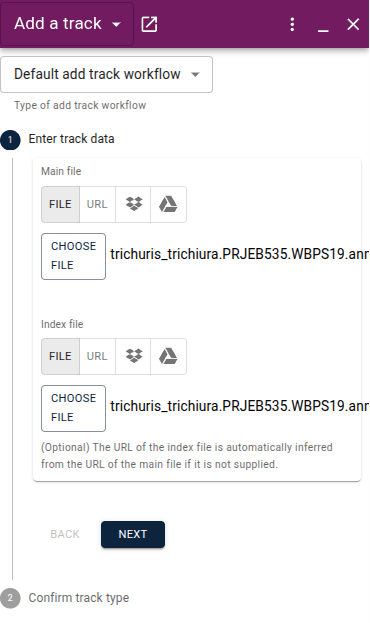
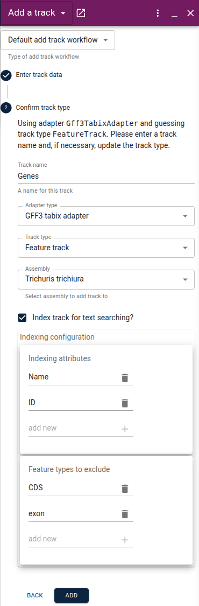
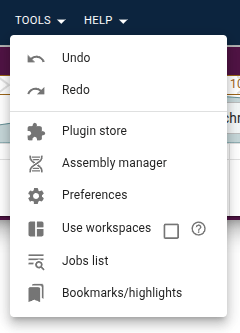
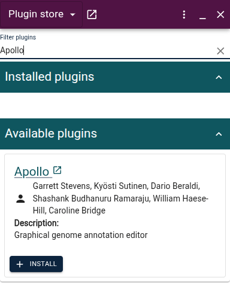
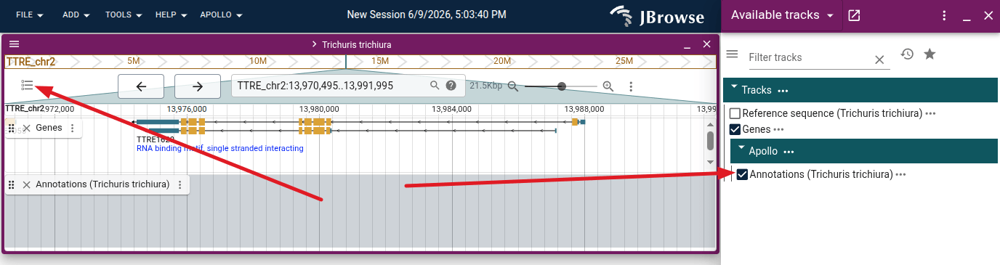
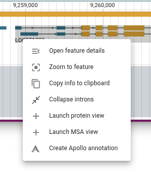
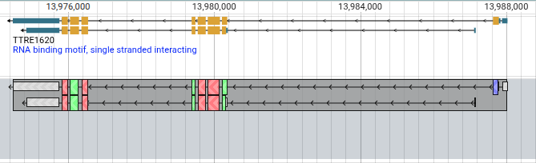

# Apollo on JBrowse Desktop

To get started with Apollo on JBrowse Desktop, you'll first need to download and
install JBrowse desktop on your computer. See the
[downloads page](https://jbrowse.org/jb2/download/) of the JBrowse website to
get started.

## Tutorial

In this tutorial, we'll set up Apollo in JBrowse Desktop to work on a genome
that we have the files for on our computer. To start, download these files to
your computer.

- https://apollo.jbrowse.org/demo/data/Trichuris/trichiura/trichuris_trichiura.PRJEB535.WBPS19.genomic.fa.gz
- https://apollo.jbrowse.org/demo/data/Trichuris/trichiura/trichuris_trichiura.PRJEB535.WBPS19.genomic.fa.gz.fai
- https://apollo.jbrowse.org/demo/data/Trichuris/trichiura/trichuris_trichiura.PRJEB535.WBPS19.genomic.fa.gz.gzi
- https://apollo.jbrowse.org/demo/data/Trichuris/trichiura/trichuris_trichiura.PRJEB535.WBPS19.annotations.genes.sorted.gff3.gz
- https://apollo.jbrowse.org/demo/data/Trichuris/trichiura/trichuris_trichiura.PRJEB535.WBPS19.annotations.genes.sorted.gff3.gz.tbi

Now open JBrowse Desktop and from the start screen select "Open new genome". In
the dialog that opens, enter "Trichuris trichiura" as the assembly name. Then
change the adapter type in the dropdown menu to "BgzipFastaAdapter". Use the
"Choose file" buttons to select the three genome files you downloaded above (the
.fa, .fai.fai, and .fa.gzi files). Then click "Submit".

Next click "Launch view" (making sure that "Linear genome view" is selected) and
then click "Open". Click the "Open track selector" button in the view that
appears.

We are now going to add a gene track with some gene models that we eventually
want to edit. To add this track, start by clicking the "+" button in the bottom
right of the track selector side panel and then click "Add track."

In the "Add a track" side panel, select "File" and then "Choose file" and choose
the remaining files for the main and index files (.gff.gz and .gff.gz.tbi
files). Then click "Next."

On the next page, change the track name to "Genes" and then click "Add."

To check that the track loaded correctly, enter
"TTRE_chr2:13,970,500..13,992,000" in the view's location box and press
<kbd>Enter</kbd>. You should see the Gene "TTRE1620" in the track.

Let's say you wanted to try editing one of this gene models. That is where we
can use Apollo. To add Apollo to JBrowse, first open the "Tools" menu in the top
menu bar and select "Plugin store."

Then either scroll down or search for Apollo in the plugin store and click the
"Install button."

The app will then reload. Re-open the track selector by clicking the track
selector button in the view header. You'll now see that there is a new track
category called "Apollo" with a track called "Annotations (honey bee (DH4
2018))". Select that track to open it.

To start editing a gene model, right click on a gene in the RefSeq track and
select "Create Apollo annotation."

In the dialog that pops up, click "Create." The gene model will then appear in
the Apollo Annotations track.

Congratulations! You've now started using Apollo. For guidance on what types of
edits you can make to the gene model annotation, see our
[user guide](../user-guide/).
