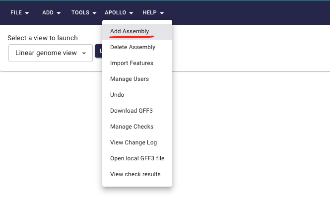
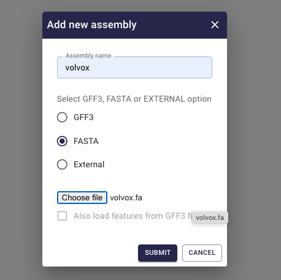
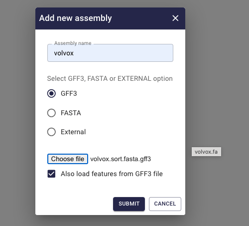
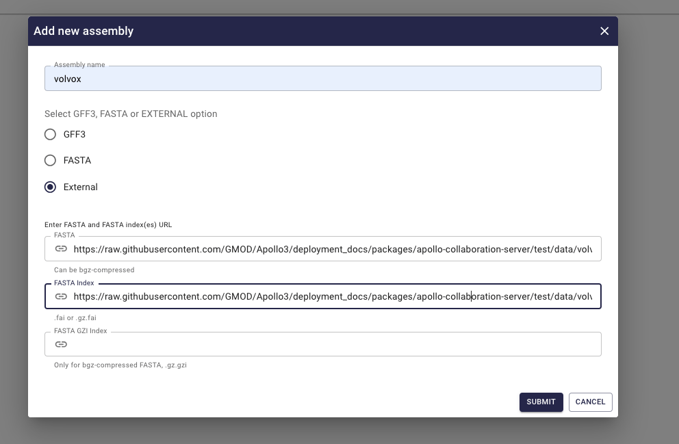
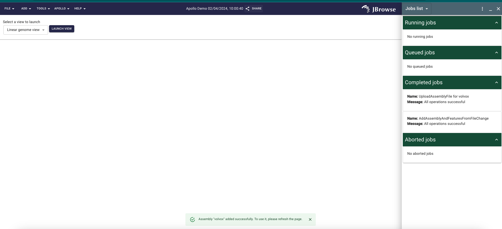
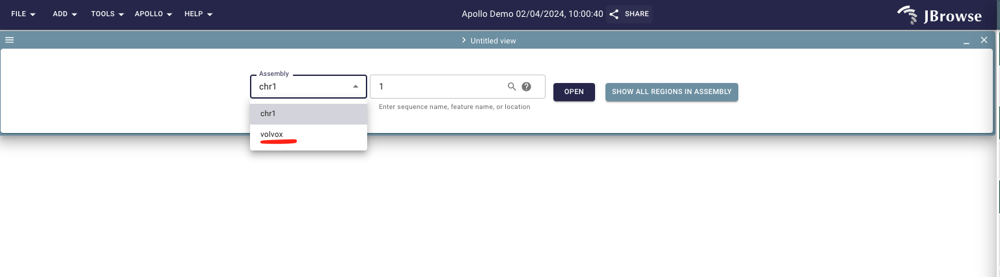

# Upload assembly

This guide will walk you through the process of uploading an assembly file to
Apollo3.

1. Navigate to the [Apollo3](https://apollo.jbrowse.org/demo) and log in to your
   account.
2. Click on the `Add Assembly` button under the `Apollo` dropdown from top
   navigation bar. 
3. Now we have 3 options to upload the assembly:

   - Upload fasta file containing sequence

   

   - Upload gff3 file containing annotation along with sequence. If we want to
     upload annotations along with the sequence, we need to select
     `Also load features from GFF3 file`.

   

   - Instead of uploading the files, we can also provide the URL of the files
     and query the data on the fly.

   

4. After selecting appropriate option and providing the necessary files, click
   on the `Submit` button. We can see the progress of the upload in the
   `Jobs list` widget and once the upload is complete we get a success message.

5. Now click on `Launch view' button to view the uploaded assembly in Apollo3
   (If its not visible please refresh the page).

Now we have successfully uploaded the assembly to Apollo3 and can start
browsing/annotating the genome.
