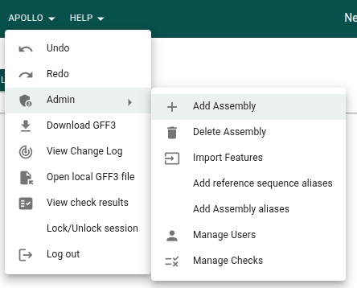
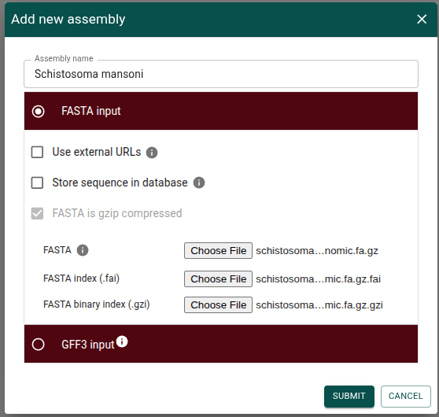
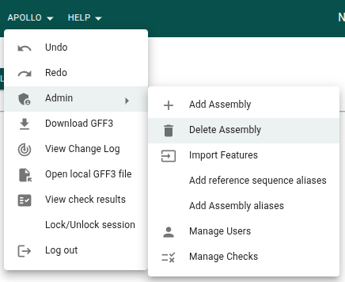
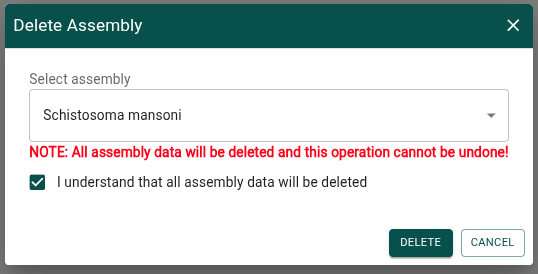

# Assemblies

In Apollo, we use the term assembly to refer to the genomic sequence that
underlies the annotations that Apollo stores. This could be, for example, a
reference sequence you obtain from a public resource, or a sequence you
assembled using your own read data.

## What do I need to add an assembly in Apollo?

To add an assembly in Apollo, you'll need the sequence in
[FASTA](//www.ncbi.nlm.nih.gov/genbank/fastaformat/) format. You'll also need to
index (and optionally compress) the file. A full description of indexing FASTA
files is outside the scope of this guide, but in general you will want to use
the tool `samtools` to index the FASTA file. For example:

For example, if I have a file called my_genome.fa, I would run

```sh
# I have a FASTA file named my_genome.fa
samtools faidx my_genome.fa
# This generates a file called my_genome.fa.fai
# I would provide both these files to Apollo
```

To save disk space on your server, you can compress the FASTA file with a tool
called `bgzip` (provided by the `htslib` tool suite) before indexing it.

```sh
# I have a FASTA file named my_genome.fa
bgzip my_genome.fa
# This compresses my file and renames it to my_genome.fa.gz
samtools faidx my_genome.fa.gz
# This generates two files called my_genome.fa.gz.fai and my_genome.fa.gz.gzi
# I would provide all three of these files to Apollo
```

When you add the assembly to Apollo, it will store a copy of these files on its
server to use when needed.

## Advanced options

### Using externally hosted files

If you already have a copy of your sequence files stored at a URL your server
can access, you can opt to point your server at those files instead. This could,
for example, be the case if you work in a lab that has a shared static file
server that hosts lab resources.

Make sure this file is always available to the server, since if it gets deleted
or otherwise becomes inaccesible, that assembly in Apollo will no longer work.

### Storing the sequence in the database

Instead of uploading a copy of the sequence files and using those to query for
the sequence, Apollo can store the sequence directly in its database. This comes
with performance impacts, especially for larger assemblies, and so is not
typically recommended.

There are plans to support editing the assembly's sequence in Apollo someday,
and at that time this option may become more commonly used, but for now it
should probably be avoided.

### Providing the sequence in a GFF3 file

You can also provide the sequence as a FASTA sequence
[embedded in a GFF3 file](//github.com/The-Sequence-Ontology/Specifications/blob/master/gff3.md#other-syntax).
This also stores the sequence in the database (see
[above](#storing-the-sequence-in-the-database)), and so is not typically
recommended unless you are working with a very small assembly.

When providing the sequence in a GFF3 file, you also have the option to import
the annotation features in the GFF3 file at the same time. See
[annotation features](annotation-features) for more information on importing
features.

## How to add an assembly

### Adding an assembly in the GUI

From the Apollo menu, choose the "Admin -> Add assembly" menu item.



Give the assembly a name and select the FASTA and index files (see
[above](#what-do-i-need-to-add-an-assembly-in-apollo)).



Adding an assembly may take some time. When it has finished being added, a
notification will appear at the bottom of the screen. To see the newly added
assembly, refresh the page.


### Adding an assembly with the CLI

For instructions on logging in before running these commands, see the
[CLI guide](cli).

You can add an assembly by running the following command. The FASTA index files
will also need to exist, but if they use the standard file naming convention the
CLI will automatically find them. The indexes can also be explicitly provided by
passing the correct flags to the command. See more options in the
[CLI docs for this command](cli/assembly#apollo-assembly-add-from-fasta-input).

```sh
apollo assembly \
  add-from-fasta \
  /data/schistosoma_haematobium.TD2_PRJEB44434.WBPS19.genomic.fa.gz \
  --assembly 'Schistosoma haematobium'
```

## How to delete an assembly

### Deleting an assembly in the GUI

From the Apollo menu, choose the "Admin -> Delete assembly" menu item.



Select the box confirming that you understand all data related to this assembly
and its annotations will be deleted and click "Delete".



### Deleting an assembly with the CLI

For instructions on logging in before running these commands, see the
[CLI guide](cli).

```sh
apollo assembly delete --assembly 'Schistosoma haematobium'
```
