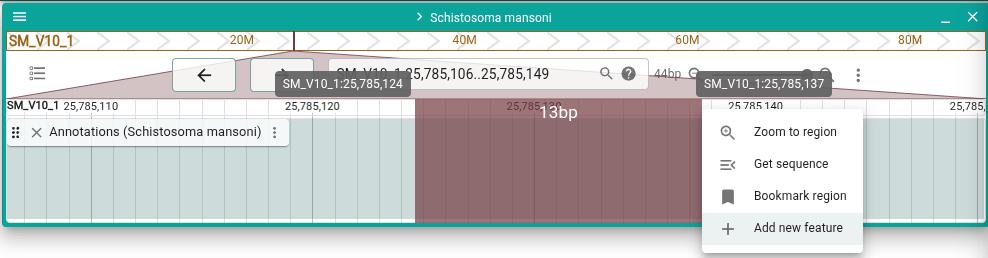
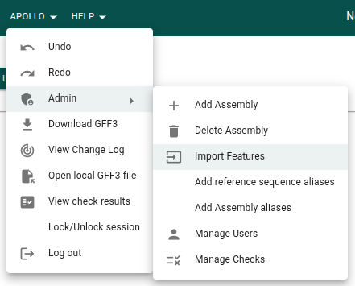
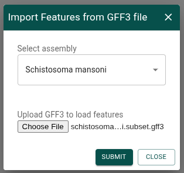

# Annotation features

The core of Apollo is its ability to perform genomic feature annotation. These
annotations are stored as "annotation features," and most of the actions done in
Apollo manipulate these features in some way.

What exactly is an annotation feature? Let's say you have a GFF3 with existing
annotations that you are going to import into Apollo. In this GFF3 you'll likely
have some lines describing a gene, including its transcripts, exons, and coding
sequences. In Apollo, this gene will be stored as an annotation feature, with
all its structural (e.g. start and end position) and other (e.g. column 9)
attributes. The transcripts of the gene, with their structural and other
information, will be inside the gene annotation feature as "child" features.
Exons and CDS are similarly stored as child features of transcripts.

This means that an annotation feature is a description of a single genomic
feature, optionally with multiple different parts stored as children. It can be
helpful to understand this hierarchical structure when editing annotation
features in Apollo.

Typically in Apollo, you'll add an assembly and then import annotation features
for that assembly. You can then use those imported features as a base, editing
them to make them more correct or to add more information to them. You can also
add new annotation features and remove existing ones.

## Do I need to import annotation features?

No! Apollo can be used without importing annotation features. Sometimes people
wish to only add the annotation features to Apollo that they are going to
change, so they don't want to import their whole GFF3. In this case, you'll
likely have a GFF3 file loaded as an [evidence track](evidence-tracks), and you
can copy the features from the evidence track into Apollo by right-clicking on
the feature you want and selecting "Create Apollo annotation." You can also
create annotation features from alignment reads in an evidence track, or by
selecting a region from the ruler and choosing the "Add new feature" menu item.



## How to import annotation features

### Importing annotation features in the GUI

From the Apollo menu, choose the "Admin -> Import features" menu item.



Select the assembly and the GFF3 file.



Importing features may take some time. When the import has finished, a
notification will appear at the bottom of the screen. To see the newly added
features, refresh the page.


### Importing annotation features from the CLI

For instructions on logging in before running these commands, see the
[CLI guide](cli).

The following is an example of importing annotation features from a GFF3 via the
CLI. See more options in the
[CLI docs for this command](cli/feature#apollo-feature-import-input-file).

```sh
apollo feature \
  import \
  /data/schistosoma_haematobium.TD2_PRJEB44434.WBPS19.annotations.genes.gff3 \
  --assembly 'Schistosoma haematobium'
```
