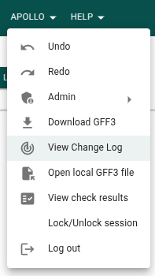
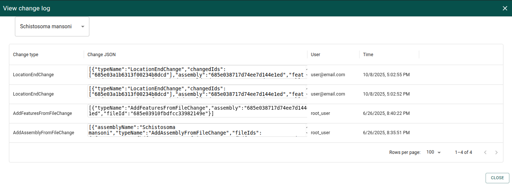

# Changelog

Each time data is changed in Apollo, the details of the change are recorded.
This list of changes is referred to as the changelog.

## How to access the changelog

### Viewing the changelog in the GUI

From the Apollo menu, choose the "View Change Log" menu item.



You can change which assembly you are viewing the changes for in the drop-down
box at the top left.



### Retrieving the changelog with the CLI

For instructions on logging in before running these commands, see the
[CLI guide](cli).

The following will retrieve the changelog and write it to a file. For more
options, including filtering the retrieved changes by assembly, see the
[CLI docs for this command](cli/change).

```sh
apollo change get > changelog.json
```
