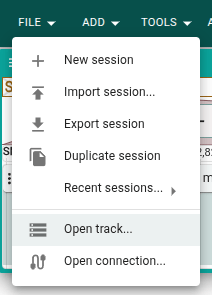
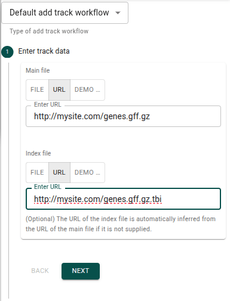
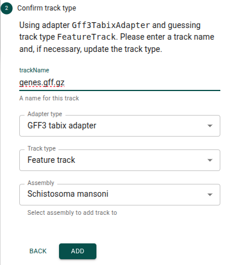
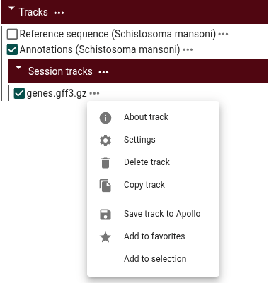

# Evidence tracks

When you open an Apollo assembly in the user interface, you'll see two tracks
that Apollo adds for every assembly. One is a reference sequence track, and the
other is the annotation track, where the
[annotation features](annotation-features) are displayed. We will refer to any
other tracks besides these two as **Evidence tracks** in this guide.

## What kinds of evidence tracks can I add?

You can add any tracks that JBrowse supports as evidence tracks. See a list of
possibilities in the
[JBrowse docs](//jbrowse.org/jb2/features/#supported-data-formats). Here are
some common evidence track types.

### Gene or other feature track (as indexed GFF3)

Some examples of using a gene track for annotation evidence include

- Showing a de-novo gene prediction track and comparing it against existing
  annotation features to look for missing genes.
- Showing genes lifted over from another species to compare to existing
  annotation features.
- Displaying an set of genes curated by someone else to look for missing
  transcripts in the existing annotation features.

Any transcripts in these tracks can be added to a new or existing gene in
Apollo. This feature is accessed by right-clicking on the transcript in the
evidence track.

### Alignments track (as indexed BAM or CRAM)

An especially common use case for alignments tracks as evidence tracks are
RNA-seq tracks. You can add an alignments read as a transcript in a new or
existing gene in Apollo, which is especially useful when you have long-read
alignments. This feature is accessed by right-clicking on the alignments read in
the evidence track.

### Region annotation track (as indexed BED or BigBed)

These types of tracks often highlight certain regions that may be relevant to
determining the correctness of annotations. For example, regions that contain
repeats, regions that have been determined to contain transcriptional start
sites, or regions that have been determined to contain poly(A) sites.

### Quantitative track (as BigWig)

Quantitative tracks can be useful to show varying levels of some data across the
genome. This could be:

- Gene expression levels, e.g. CAGE (cap analysis gene expression)
- Evolutionary conservation levels
- Alignments coverage

### Synteny track (as PAF or indexed PAF)

If you have two or more assemblies in Apollo, you can load data that relates
positions in two assemblies as a PAF file. This can then be visualized as
evidence by in JBrowse's linear synteny view.

## How to add evidence tracks

Adding evidence tracks involves modifying the [JBrowse configuration](jbrowse)
served by Apollo. It can be done from the GUI or the CLI.

You'll need to provide a URL for the track data files when adding a track. It's
common to serve these files from the same server you use to serve the JBrowse
app files. See the
[deployment examples](../installation/background#deployment-examples) in the
installation guide for more information.

### Adding evidence tracks in the GUI

From the File menu, choose the "Open track..." menu item.



Enter the URL of the track (and optionally its index file) in the "Add a track"
widget and click "Next." Note that local files will not work when saving to
Apollo.



Confirm the track type and assembly, and optionally change the track name, in
the "Add a track" widget and click "Add."



Now that the track is visible as a session track in JBrowes, open the track menu
and select "Save track to Apollo." This will move the track out of the session
tracks and store it in Apollo's JBrowse configuration.



### Adding evidence tracks with the CLI

For instructions on logging in before running these commands, see the
[CLI guide](cli).

If you have more than one assembly, you'll first need to figure out the assembly
name that JBrowse uses internally for your assembly. One way to find this out is
to run this command.

```sh
apollo assembly get
```

In the output, you want the `_id` field of the assembly. You can get this
programaticallyi using `jq` like this.

```sh
MANSONI_ID=$(
  apollo assembly get |
    jq --raw-output '.[] | select(.name=="Schistosoma mansoni")._id'
)
```

You'll then need to retrieve a copy of the JBrowse `config.json` from Apollo.
See the [JBrowse guide](jbrowse#how-to-edit-the-jbrowse-configjson) for how to
do that. Once you have the `config.json`, you can use the
[JBrowse CLI](https://jbrowse.org/jb2/docs/cli/) to add the evidence tracks.

```sh
jbrowse add-track \
  https://mysite.com/genes.gff.gz \
  --name "Gene models" \
  --assemblyNames "${MANSONI_ID}"
```

See the
[docs for the `add-track` command](https://jbrowse.org/jb2/docs/cli/#jbrowse-add-track)
for more options.

After adding the evidence tracks, follow the steps in the
[JBrowse guide](jbrowse#how-to-edit-the-jbrowse-configjson) to load the updated
configuration into Apollo.
