# Annotating

Open a new browser tab and navigate to http://localhost.

Click on Linear Genome View on the JBrowse start screen.

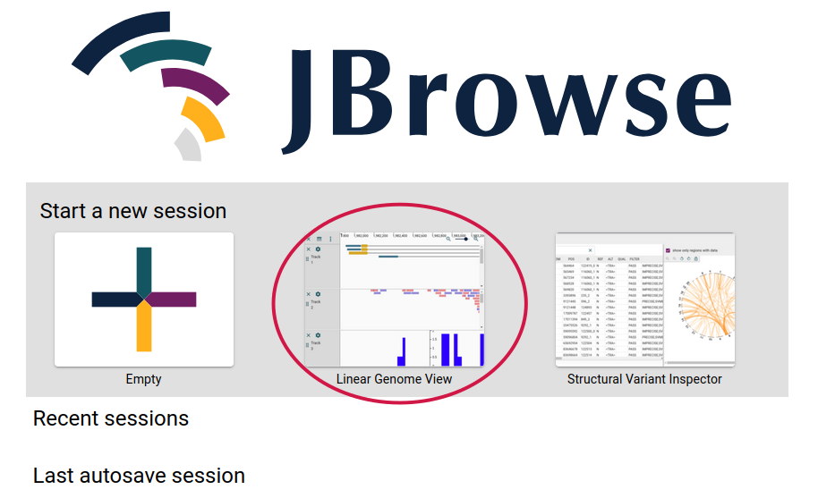

Click on "Continue as Guest"

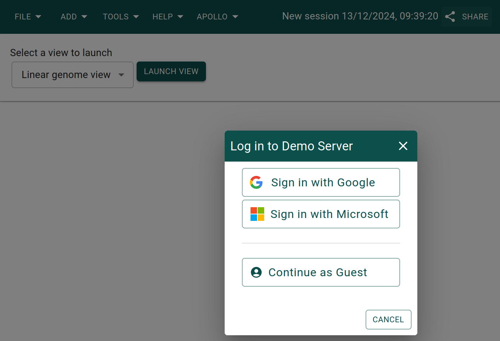

Select "Schistosoma mansoni" as the assembly and put the region
`SM_V10_3:9,657,491..9,659,958` in the location box, then click "Open".
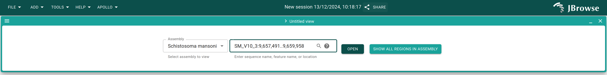

Alternatively, you could leave the location box alone and click "Open", and then
put the above region in the location box and press "Enter".

Click "Open track selector". Select track called "Annotations (Schistosoma
mansoni)".

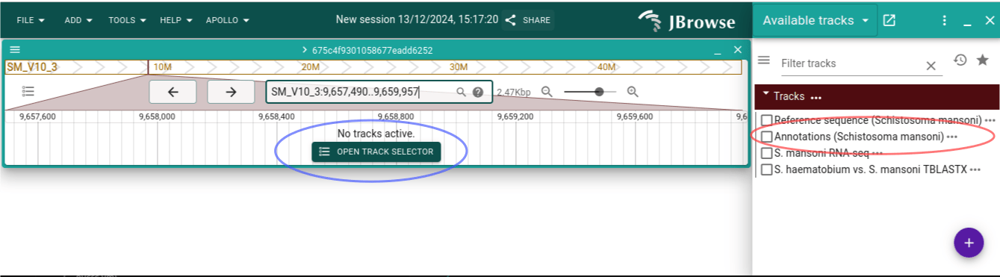

Try out clicking and dragging to move back and forth, as well as using the arrow
buttons in the header. Also try out clicking the zoom buttons.

Let's focus on the end of the CDS. If we hover over the warning, we'll see that
the CDS is missing a stop codon.

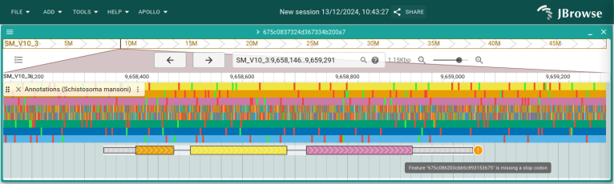

Click and drag in the ruler the area around the end of the CDS and then select
"Zoom to region". We can see that the CDS stop short of the stop codon. Click
and drag the right side of the CDS 3 bases to the right to fix it. Zoom back out
so you can see the whole gene again, and you will see the warning about the stop
codon is gone as well.

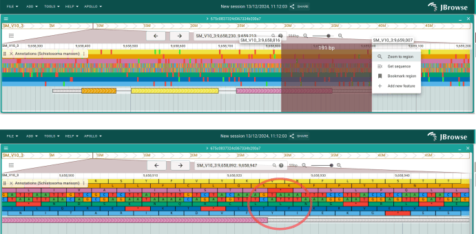

Now click the checkbox to open the RNA-seq track. It looks like this feature's
3\` UTR is actually longer. Let's extend the exon to fix that. Click on the
track menu (the three dots next to the track name label) and select "Appearance
-> Show both graphical and table display. A table showing the information about
the current annotation is now shown at the bottom of the track. In the "gene"
row, change then "end" value to `9659388`, and then do the same for the "mRNA"
column.

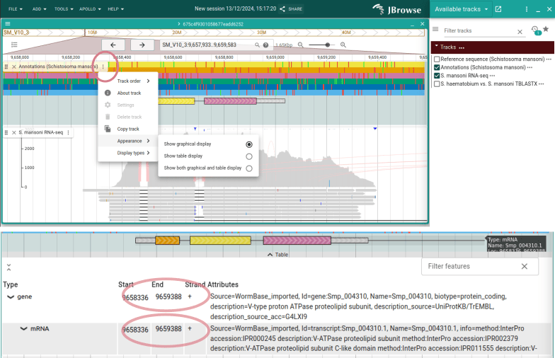

We could also do the same for the exon, but we'll do it a different way as a
demonstration. Right-click on the exon and choose "Edit feature details". Change
the "End" box in the new panel to `9659388` and see that the exon extends.

Next click "Add new" in that same panel and add "Note" as a custom attribute
key. Click "Add", and then in the newly added "Note" attribute, add some text
(e.g. "UTR extended due to RNA-seq evidence").

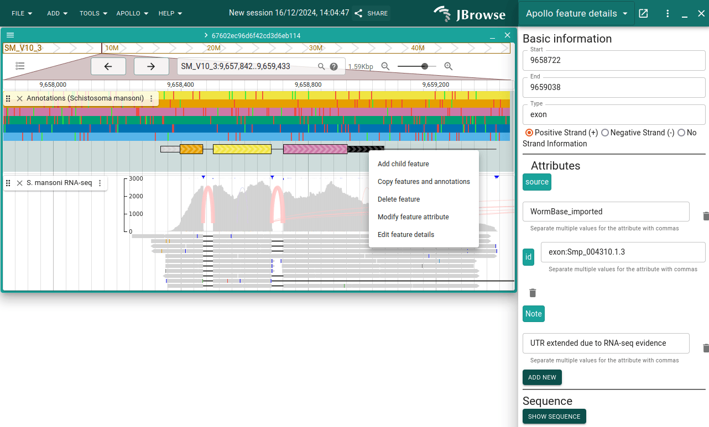

Now re-open the track selector and select the synteny track (_S. haematobium vs.
S. mansoni TBLASTX_). Right-click on one of the features and choose "Open
synteny view for this position". Leave the default and click "Submit". Then
close your original Linear Genome View by clicking on the cross circled in red.

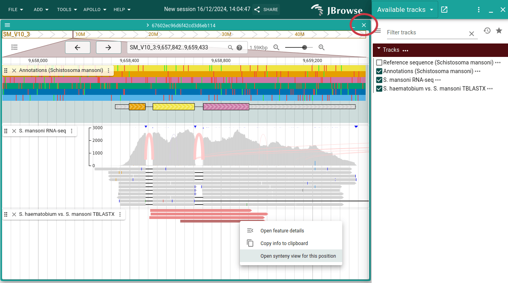

Click "Open track selector" on the top track and then open the Annotations and
RNA-seq tracks. Do the same on the bottom view. We might want the annotations
closer to each other, so in the top view, open the track selector of the RNA-seq
track and select "Track order -> Move track up".

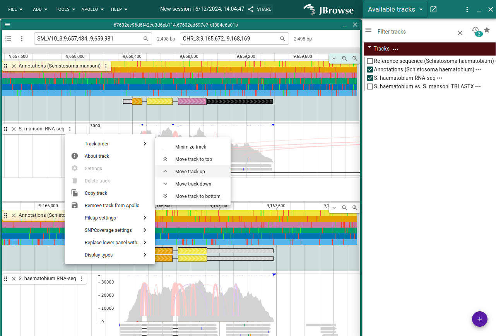

If you wanted to share this particular view, you can click the "Share" button at
the top and copy the link. You can also use this for coming back to the same
view later.

Now close the synteny view, select "Linear genome view" and click "Launch view".
This time we'll enter the gene's ID, `Smp_124460`, into the search box and click
"Open." You can also try searching for `ATPase` and see that there are two
matches for that term. The one we're working on is the first match.

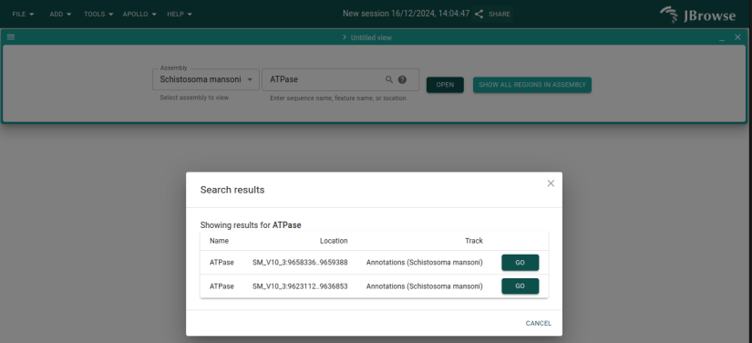

Somewhere to the side of the existing gene, click and drag an area in the ruler
and then select "Add new feature". Look a the possible ontology types suggested,
and then choose "match". On the new feature, click "Add child feature" and
choose the coordinates and "Match part" as the type.

Now right-click on the "match" feature and select "Delete feature".

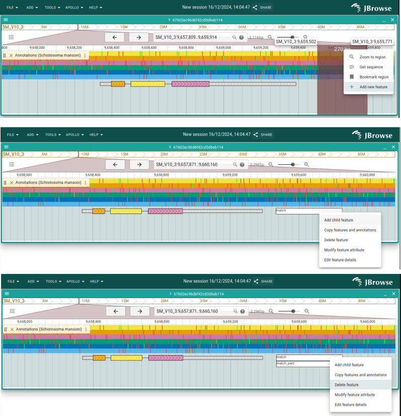
