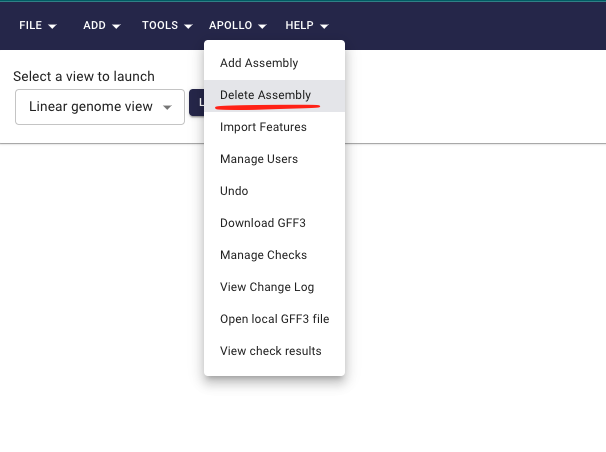
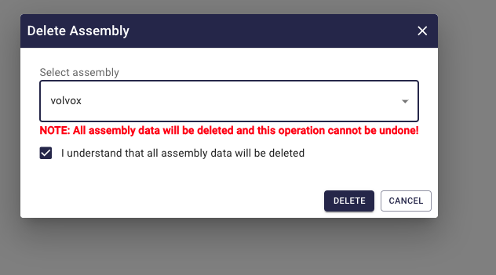

# Delete assembly

This guide will walk you through the process of deleting an assembly from Apollo3.

1. Navigate to the [Apollo3](https://apollo.jbrowse.org/demo) and log in to your account.
2. Click on the `Delete assembly` button under the `Apollo` dropdown from top navigation bar.

3. In the delete assembly dialog, select the assembly which you want to delete and click on the `Delete` button.

