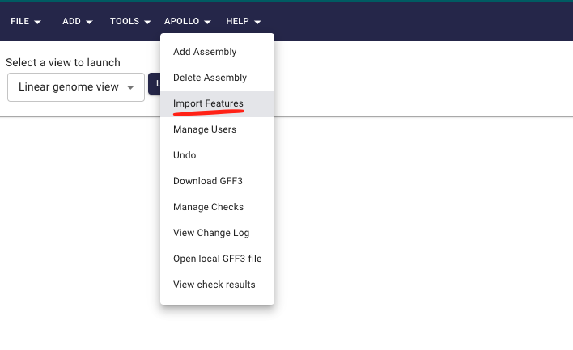
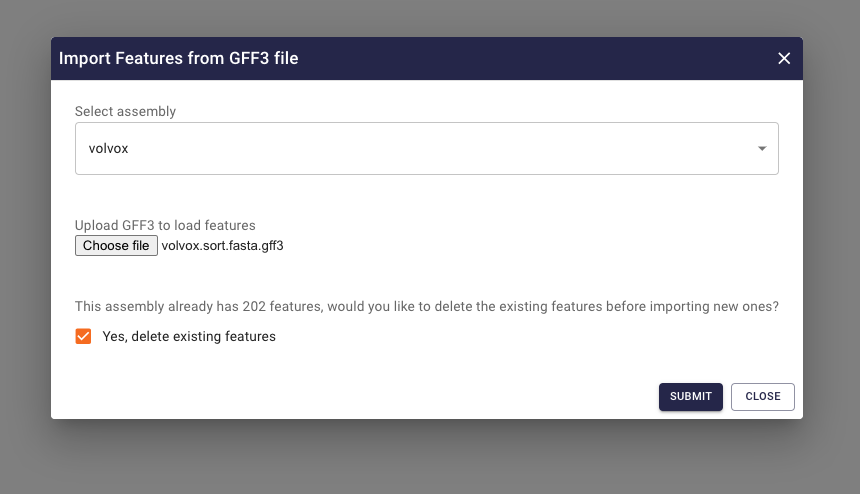
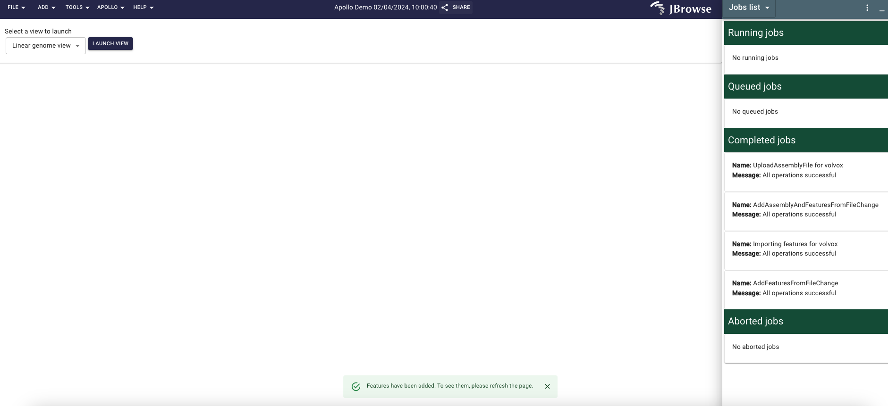
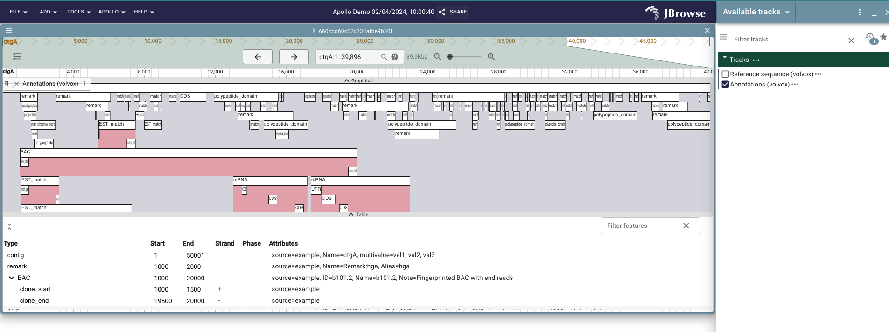

# Import features

This guide will walk you through the process of importing features/annotations
to Apollo3 using GFF3 file.

There are two ways to import features to Apollo3:

- Follow steps mentioned in [Upload assembly](/docs/user-guide/upload-assembly)
  guide to upload the GFF3 file containing features and sequence.
- Use the `Import features` button in the `Apollo` dropdown from top navigation
  bar to import features to an existing assembly.

In the guide below, we will walk you through the process of importing features
to an existing assembly.

1. Navigate to the [Apollo3](https://apollo.jbrowse.org/demo) and log in to your
   account.
2. Click on the `Import features` button under the `Apollo` dropdown from top
   navigation bar.

3. In the import features dialog, select the assembly to which you want to
   import the features and click on the `Choose file` button to select the GFF3
   file containing features.
4. If the features were already imported to the assembly, you have option to
   delete exiting features and import the new features by selecting the
   `Yes, delete existing features` checkbox.

5. Click on the `Submit` button to start the import process. We can see the
   progress of the import in the `Jobs list` widget and once the import is
   complete we get a success message.

Now we should be able to see the imported features in the apollo track and can
start annotating the genome.
