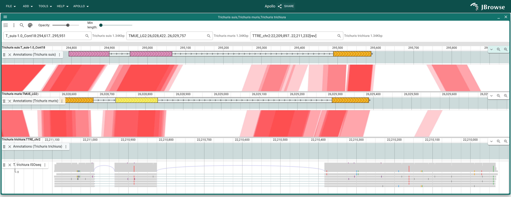
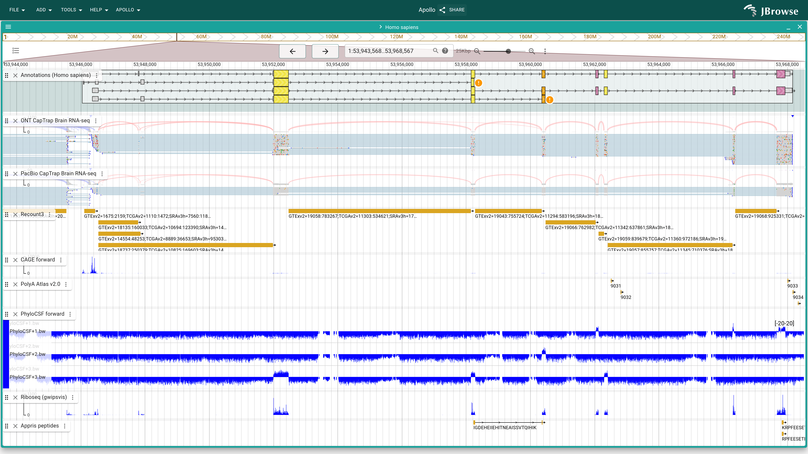
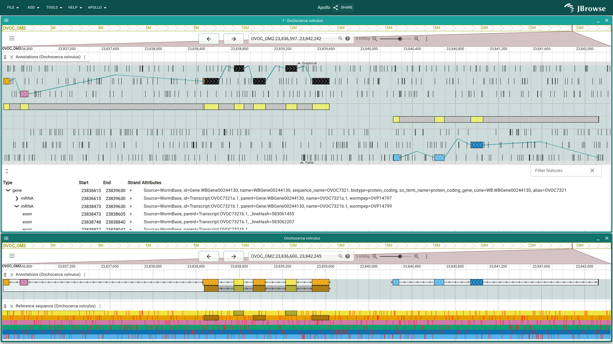

# 2026 paper

The demos linked here are based on the use cases presented in our 2026
in-submission paper on Apollo 3. These demos are set up for Apollo to use local
editing. This means the Apollo track (labeled "Annotations") will be empty when
you first open the link. To try out the Apollo track, right-click on a gene in
the gene track and select "Create Apollo annotation". It will then copy the gene
to the Apollo track, where it can be edited.

## Multi-genome curation project

[Session link](https://apollo.jbrowse.org/paper_2026/?session=share-O4MEYslLhE&password=czp9i)

## Single genome with deep evidence

[Session link](https://apollo.jbrowse.org/paper_2026/?session=share-JyLH0CjvFb&password=VaUG7)

## Single local genome

[Session link](https://apollo.jbrowse.org/paper_2026/?session=share-Wgf5q9Wclz&password=MDqqg)
